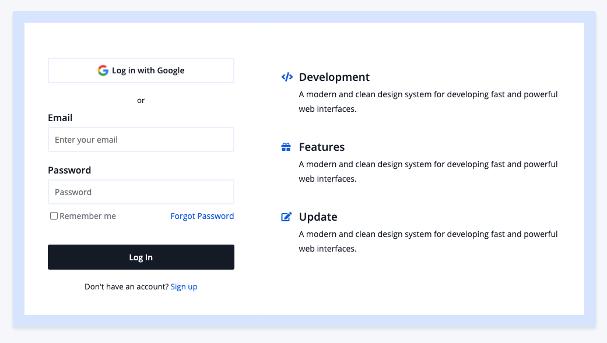
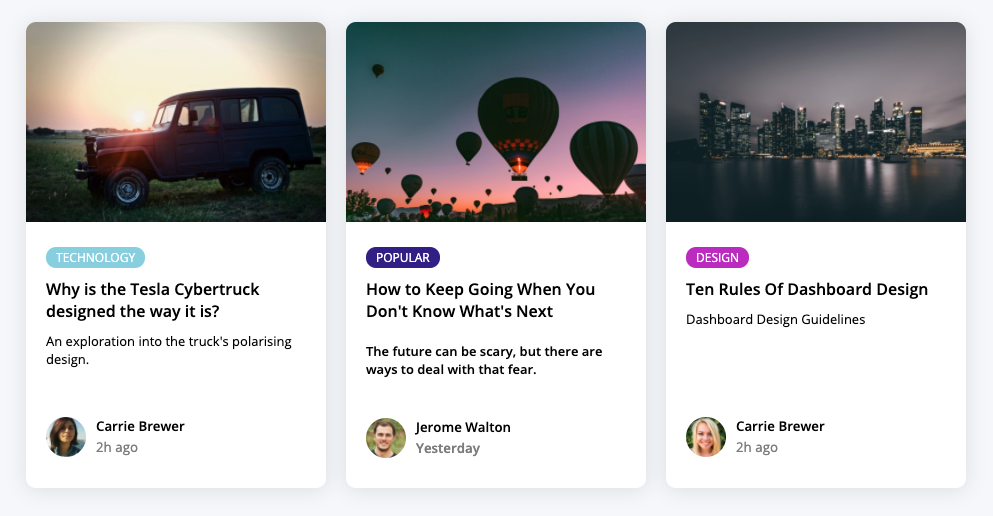
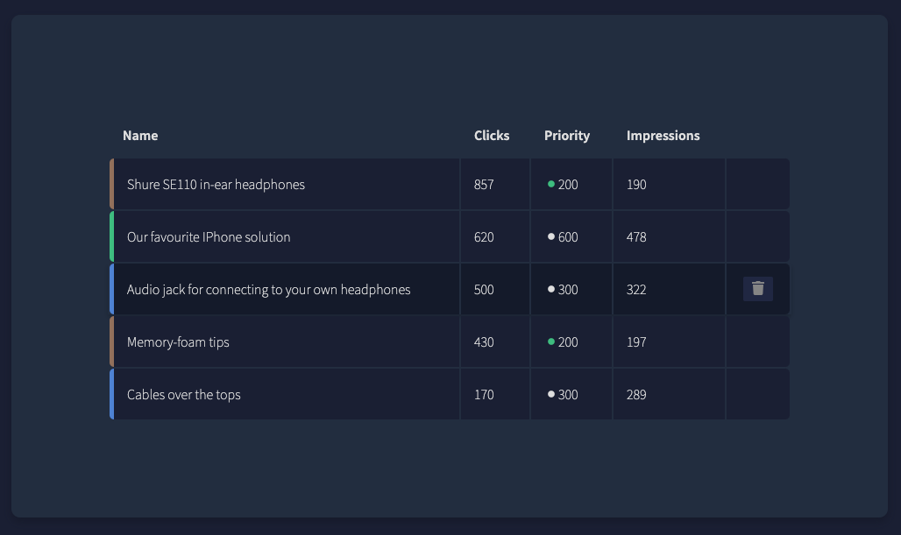

# HTML and CSS components

A number of useful components built with HTML and CSS.

# Screenshots

Login component

Blog posts component

Ads manager component

## Author

- Albert Stjärne (https://github.com/AlbertStjarne)
